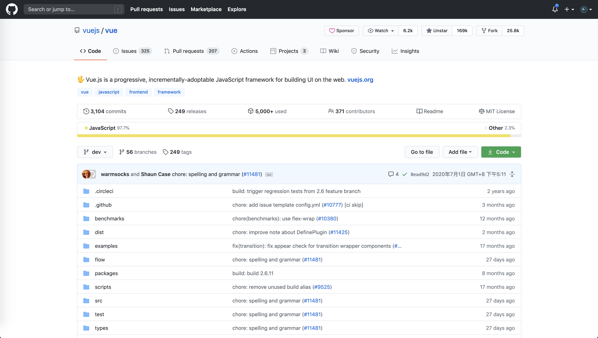

# github-custom-styles

features:

* Fixed content `max-width` to `1280px`;
* Change button `border-radius` to `4px`;
* Move right sidebar to top;
* Custom repo stats navigation;
* Fold & unfold repo files;

## Install

1. Required tampermonkey [Tampermonkey](https://www.tampermonkey.net/index.php)

2. Install script: [Greasyfork](https://greasyfork.org/zh-CN/scripts/405969-github-custom-styles)

## Preview

old:

new:

